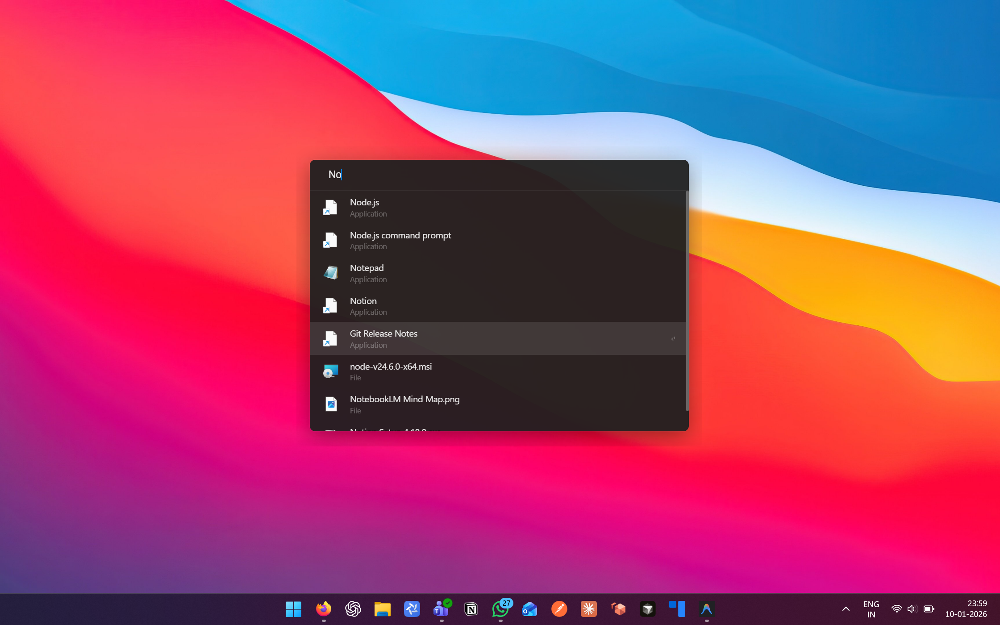

# Butler

A fast, lightweight Windows launcher with instant search and clipboard management. Inspired by macOS Spotlight and Raycast.



## Features

- ⚡ **Instant Search** - Find apps, files, and folders instantly
- 📋 **Clipboard History** - Access your clipboard history with a shortcut
- 🎨 **Minimal UI** - Clean, distraction-free interface
- 🖼️ **Native Icons** - Real Windows app icons
- ⌨️ **Keyboard First** - Navigate entirely with keyboard

## Installation

### Download
Download the latest release from the [Releases](https://github.com/MonishGosar/Butler/releases) page:
- **Butler Setup.exe** - Installer with Start Menu & Desktop shortcuts
- **Butler-Portable.exe** - Portable version, no installation needed

### Build from Source
```bash
git clone https://github.com/MonishGosar/Butler.git
cd Butler
npm install
npm run dist
```

## Keyboard Shortcuts

| Action | Shortcut |
|--------|----------|
| Open Launcher | `Alt+Space` or `F1` |
| Open Clipboard | `Alt+V` or `F2` |
| Navigate Results | `↑` `↓` Arrow Keys |
| Open Selected | `Enter` |
| Close | `Esc` |

## Development

```bash
# Install dependencies
npm install

# Run in development mode
npm run dev

# Build for production
npm run dist
```

## Tech Stack

- **Electron** - Cross-platform desktop apps
- **React** - UI framework
- **TypeScript** - Type safety
- **Vite** - Fast bundling
